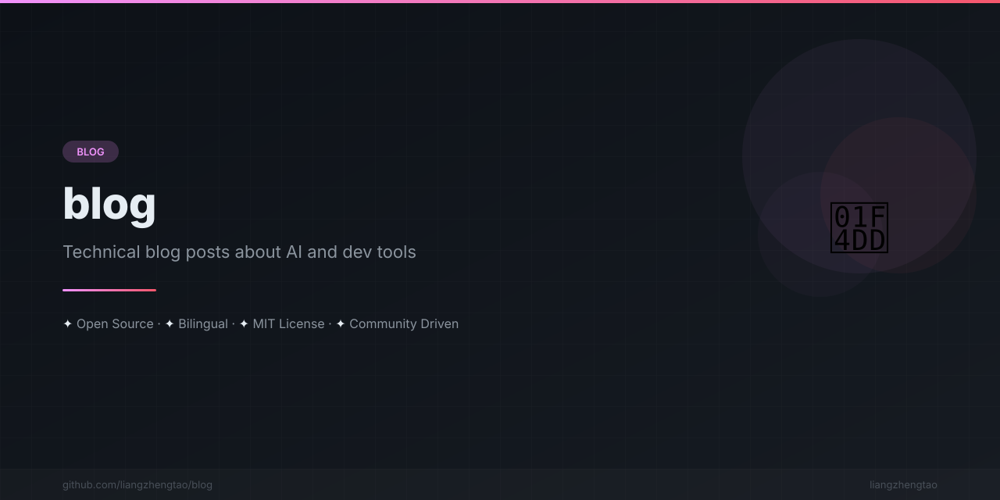

[English](README.md) | [中文](README.zh.md) | [日本語](README.ja.md) | [Français](README.fr.md) | [Español](README.es.md)
n

# Blog

> Personal blog and technical writing collection.

## Posts

- [我如何用 AI 做了 39 个开源项目](how-i-built-39-projects-with-ai.md) — 一周时间，39 个开源项目，实操指南
- [小白从零开始学 AI 路线合集](ai-learning-roadmap-for-beginners.md) — 不需要数学天才，只需要一颗想学的心
- [How I Built 28 Projects](how-i-built-28-projects.md) — A retrospective on building 28 projects in a year
- [Dev.to Post](devto-post.md) — Published article on Dev.to
- [Awesome List Submissions](awesome-list-submissions.md) — Guide to submitting to awesome lists
- [Social Media Posts](social-media-posts.md) — Collection of social media content

## License

This project is licensed under the MIT License.
